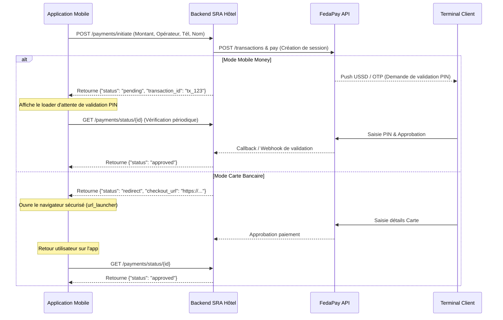

# Module de Facturation Normalisée DGI et Paiement FedaPay (Jet 1, Module 5 & 6)

Ce module gère le checkout final de la réservation, la facturation normalisée DGI (Module 5) et la passerelle de paiement Mobile Money & Carte Bancaire (Module 6) en s'appuyant sur le module indépendant `checkout`.

---

## 🏗️ Architecture Technique

Le module est encapsulé sous `lib/features/checkout/` :
- **Entities :** Gère la validation des informations de facturation (Raison Sociale, IFU).
- **Repositories :** `PaymentRepository` définit les contrats d'initiation (`initiatePayment`) et de vérification (`verifyPaymentStatus`).
- **UseCases :**
  - `InitiatePaymentUseCase` : Envoi de la demande d'initiation au serveur.
  - `VerifyPaymentStatusUseCase` : Interrogation du statut final de paiement.
- **DataSources :**
  - `PaymentRemoteDataSource` : Interroge les API `/payments/initiate` et `/payments/status/{id}` du backend FastAPI.
- **State Management (BLoCs) :**
  - `PaymentBloc` : Gère le flux d'étapes (initiation, attente de confirmation PIN, redirection carte bancaire, validation de la transaction).
- **Presentation (UI) :**
  - `PreInvoicePage` : Établit la facture normalisée à l'aide de lignes en pointillés, d'un tableau propre adaptatif et d'informations fiscales claires.
  - `PaymentBottomSheet` : Composant déroulant affichant le choix de l'opérateur (MTN, Moov, Orange, Wave, Carte Bancaire) et la saisie sécurisée du numéro de téléphone.

### Flux de Paiement (MoMo & Carte)

Le mobile communique uniquement avec le backend de l'application SRA Hôtel pour éviter d'exposer les clés d'API privées du prestataire (FedaPay) :

---

## 🛠️ Schéma de Persistance SQLite Locale
En cas d'approbation (`approved`), les données de facturation sont stockées localement dans les tables SQLite relationnelles :
-   **reservations :** Enregistrement de la réservation (status: `'confirmée'`).
-   **folio :** Dossier financier global associé (status: `'payé'`).
-   **lignes_folio :** Ligne comptable de transaction (date, prix, moyen).
-   **sync_queue :** Insertion d'une tâche de synchronisation hors-ligne (`INSERT` de réservation) pour réplication automatique.

---

## 🧪 Scénarios de Test et Simulation

### Simuler un échec de transaction (mode mock/USE_MOCKS)
Saisir un numéro commençant par `99` (ex: `+225 99 00 00 00` ou `99112233`) simulera un échec de type **provision insuffisante** envoyé par l'opérateur pour valider la transition d'erreur et le bouton de réessai.

### Simuler un succès
Saisir tout autre numéro (ou passer par le mode carte standard). La transaction passera à l'état `approved`, déclenchera le vidage du panier `CartCleared`, et basculera le reçu en **FACTURE NORMALISÉE - PAYÉE** avec les hashs de contrôle DGI.
